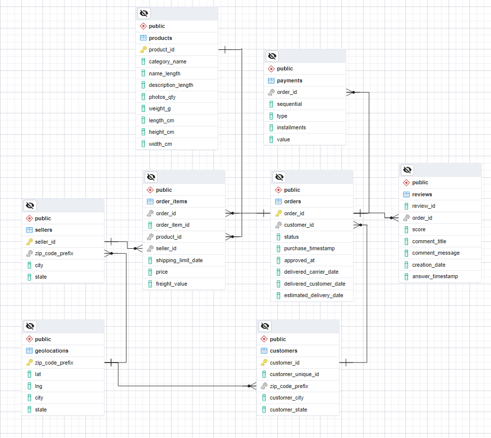

# Analyzing eCommerce Business Performance with SQL

## Overview
In any company, measuring business performance is crucial for tracking, monitoring, and evaluating the success or failure of various business processes. Therefore, this project aims to analyze the business performance of an eCommerce company, considering several business metrics: customer growth, product quality, and payment types.

## Entity-Relationship Diagram

## Query Documentation

### Data Preparation
1. **Create Tables**: 
   - `customers`
   - `geolocations`
   - `order_items`
   - `payments`
   - `reviews`
   - `orders`
   - `products`
   - `sellers`
2. **Add Primary Keys**
3. **Clear Duplicate Data on Geolocations**
4. **Fill Missing Geolocation Data**
5. **Add Relationships**

### Annual Customer Activity Growth Analysis
1. **Common Table Expression (CTE)**:
   - Monthly active users
   - Total new customers
   - Total repeat orders
   - Average total order
2. **Create Master Table**
3. **Insert Master Data**

### Annual Product Category Quality Analysis
1. **Common Table Expression (CTE)**:
   - Total revenue yearly
   - Total cancel order yearly
   - Highest revenue product category
   - Highest total cancel order product category
2. **Create Master Table**
3. **Insert Master Data**

### Annual Payment Type Usage Analysis
1. **All-Time Payment Usage**
2. **Annual Payment Usage**

---
*Note: The queries provided are documented steps for preparing data and analyzing various aspects of eCommerce business performance.*
